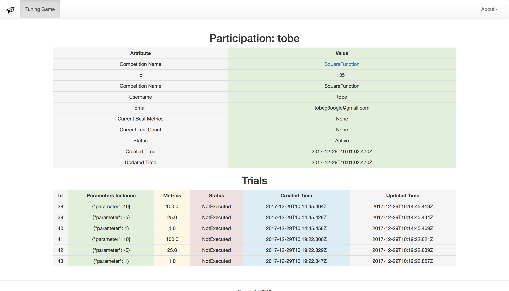
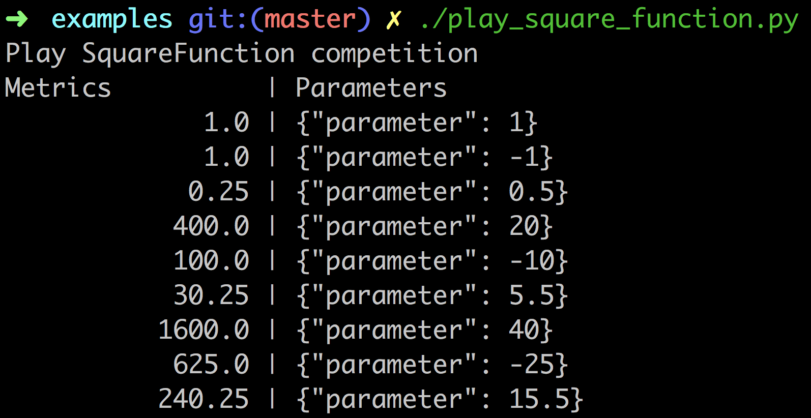

# Tuning Game



## Introduction

[Tuning Game](http://hypertune.cn:8000/dashboard/) is the kaggle-like platform for automatical hyper-parameters tuning and black box optimization.

The underlying games may be the convex optimization problem or the model's hyper-parameters tuning problem. Users can only request with parameters and get the metrics result which is like the black box optimization. It is like machine learning but not the complete modeling process. Use your experience or tuning algorithms such as BayesianOptimization to get the best score.

Intrododuce the three significant concepts in tuning game:

* Competition: The game which defines the input parameters for everyone to play.
* Participation: The player in one game which identities which game and who are you playing.
* Trial: The request parameters and metrics result of the Participation. You can try more times and the best Trial counts.

No advanced programming or modeling skills required.

## Installation

Install [tuninggame sdk](./sdk/) with `pip`.

```
pip install tuninggame
```

Or run container with `docker`.

```
docker run -it tobegit3hub/tuninggame bash
```

## Usage

If you are new to TuningGame, go to the dashboard in <http://hypertune.cn:8000/dashboard/>.

The best way to register and play the games is using [Python SDK](./sdk/).

```
endpoint = "http://hypertune.cn:8000"
competition_name = "SquareFunction"
username = "tobe"
client = TuningGameClient(endpoint)


def registry_participation():
  email = "tobeg3oogle@gmail.com"
  competition = client.get_competition_by_name(competition_name)
  client.create_participation(competition.id, username, email)


def run_trials():
  participation = client.get_participation_by_competition_name_and_username(competition_name, username)

  parameters_instance = {"parameter": 1}
  trial = client.create_trial(participation.id, parameters_instance)
  client.execute_trial(trial.id)

  parameters_instance = {"parameter": -1}
  trial = client.create_trial(participation.id, parameters_instance)
  client.execute_trial(trial.id)

  parameters_instance = {"parameter": 0.5}
  trial = client.create_trial(participation.id, parameters_instance)
  client.execute_trial(trial.id)


def check_result():
  participation = client.get_participation_by_competition_name_and_username(competition_name, username)
  client.print_participation_result(participation.id)
```



## Competitions

There are battery-included competitions in TuningGame.

* [ReturnInputGame](./tuning/competition/return_input_game.py)
* [SquareFunction](./tuning/competition/square_function.py)
* [OneUnknowQuadraticEquation](./tuning/competition/one_unknow_quadratic_equation.py)
* [MnistKerasDnn](./tuning/competition/mnist_keras_dnn.py)

It is easy to extend and add your new competition. Please add the competition logic and test files in [competition](./tuning/competition/). Then add the information of package name and path in [settings.py](./settings.py).

```
REGISTERED_COMPETITION = {
    "ReturnInputGame": "tuning.competition.return_input_game",
    "SquareFunction": "tuning.competition.square_function",
    "OneUnknowQuadraticEquation": "tuning.competition.one_unknow_quadratic_equation",
    "MnistKerasDnn": "tuning.competition.mnist_keras_dnn",
    "TwoUnknowQuadraticEquation": "tuning.competition.two_unknow_quadratic_equation",
}
```

It would be better to add the new competition in [initialize_database.py](./tuning/management/commands/initialize_database.py).

## Deployment

Users can setup the TuningGame server and try in local environment easily.

```
# Install dependencies
pip install -r ./requirements.txt

# Initialize database
./manage.py makemigrations tuning
./manage.py migrate
./manage.py initialize_database

# Run the server
./manage.py runserver 0.0.0.0:8000
```

## Test

Run the unit tests.

```
./manage.py test --pattern="*_test.py"
```

Run the smoke tests.

```
cd ./sdk/examples/

./test_tuning_game_api.py
./crud_trial.py
```

Format the code with standard tools.

```
isort **/*.py
yapf --style='{indent_width=2}' -i **/*.py
```
